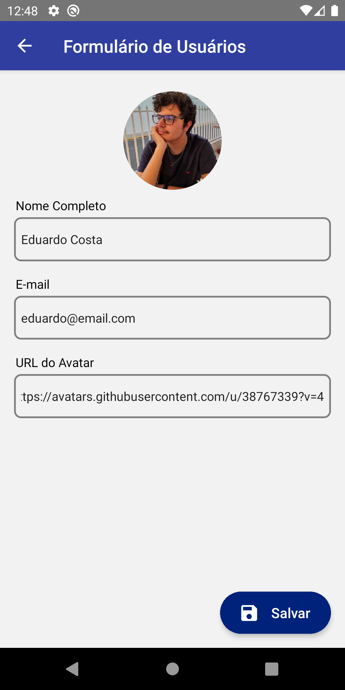
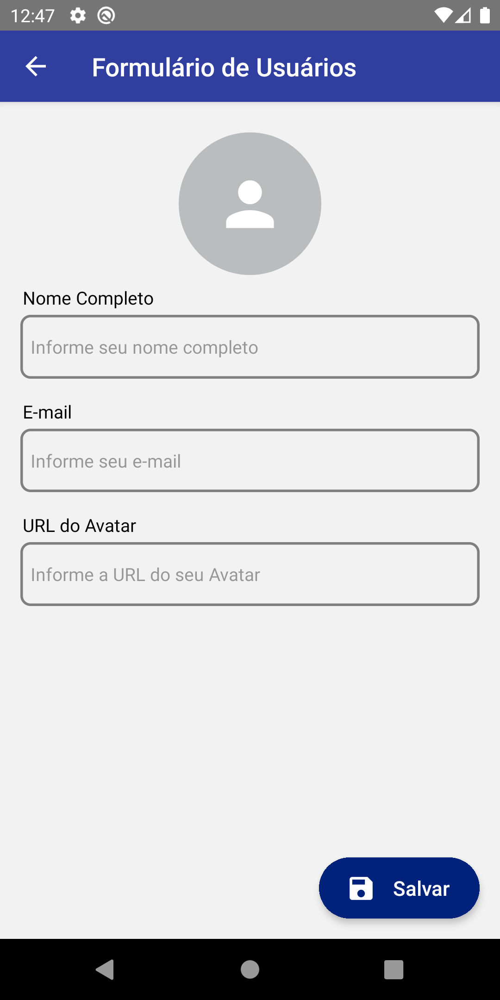

# CRUD Redux com Context API - React Native
[](#) 
[](https://github.com/duduCMT/React-Native-CRUD-Redux/blob/master/LICENSE) 
## 📸 Preview

<p align="center">
  
</p>

## 📝 **Descrição**

Aplicativo com sistema de CRUD simples usando os fundamentos de Redux e Context API no React Native. Foi testado em aparelhos físicos e virtuais Android e possui suporte para iOS.

## 🚀 **Objetivo**

Esse projeto foi criado com o objetivo de criar um aplicativo simples de cadastro, exibição, edição e remoção de usuários contendo as informações de nome, e-mail e uma URL para a imagem de perfil. Apesar de simples, o projeto cumpre o seu papel de explorar as principais features da [ContextAPI](https://pt-br.reactjs.org/docs/context.html) e do hook [useReducer](https://pt-br.reactjs.org/docs/hooks-reference.html#usereducer) do React. Além disso, foi explorado alguns componentes do [React Native Elements](https://reactnativeelements.com/docs) como o Avatar, Button, FAB, Icon e principalmente o ListItem.

## ✅ Features Funcionais
- Exibição, Cadastro, Edição e Remoção de Usuários
- Validação simples dos dados cadastrados usando Regex
- Preview da imagem na URL passada no formulário
- Distribuição dos dados usando a ContextAPI
- Manipulação dos dados fornecidos pelo useReducer

## 📎 Exemplo da estrutura de Dados
```javascript
  {
    id: 1,
    name: 'Eduardo Costa',
    email: 'eduardo@email.com',
    avatarUrl: 'https://avatars.githubusercontent.com/u/38767339?v=4'
  }
````

## 📌 Nota importante!

As imagens utilizadas no projeto foram disponibilizados gratuitamente pelo site [DiverseUI](https://diverseui.com/). As informações mockadas do projeto são meramente ilustrativas.

## 🔎 Teste Você Mesmo
📌 **Pré requisitos:**
1. Tenha o repositório baixado em sua máquina.
2. Tenha o [NodeJS](https://nodejs.org/) instalado em sua máquina
3. Tenha o [React Native CLI](https://reactnative.dev/docs/environment-setup) instalado em sua máquina junto a um virtual device Android ou iOS.

🚩 **Como Executar:**
1. Com o terminal aberto no diretório do projeto, execute o comando `npm install` para instalar as dependências.
2. Para executar o projeto você deve seguir os passos mostrados na documentação do [React Native CLI](https://reactnative.dev/docs/environment-setup). Dependendo do seu sistema operacional e plataforma de execução você deve usar comandos diferentes.
3. Caso você queira testar no Windows usando um virtual device Android execute o comando: ` npx react-native run-android `. Em outro caso, consulte a documentação no item 1.

## 📸 Preview das Telas

<p align="center">
  
  
  
</p>
   


